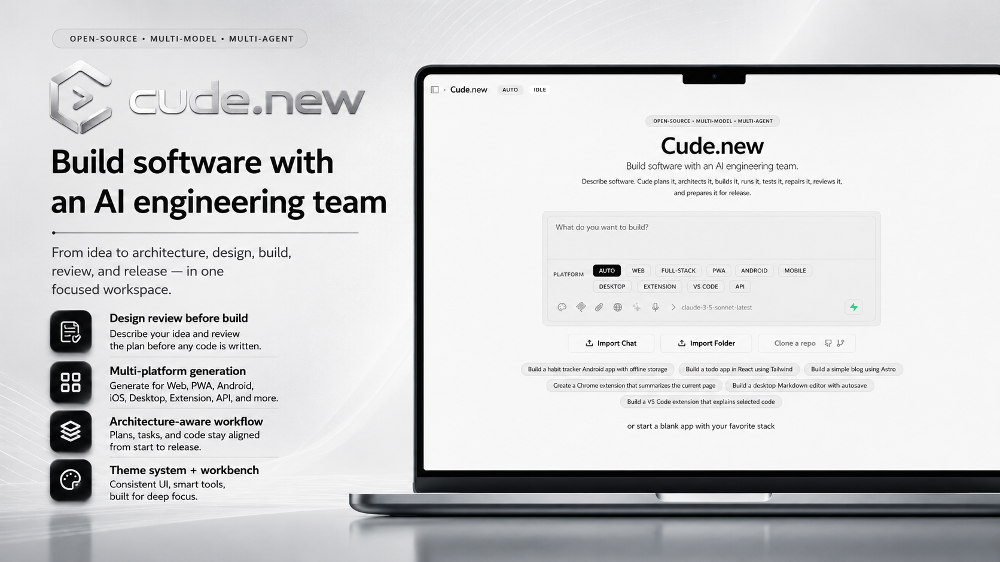
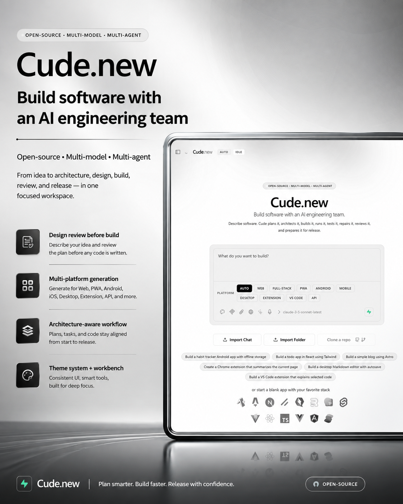
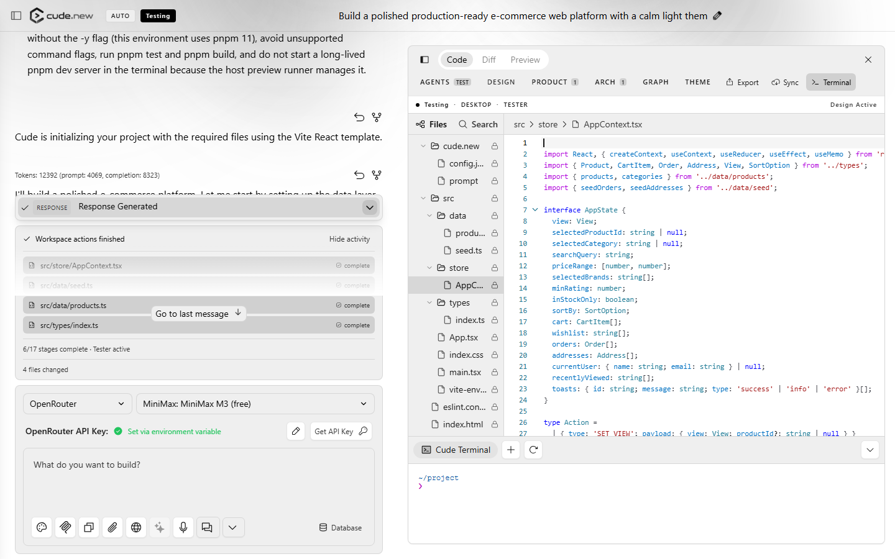
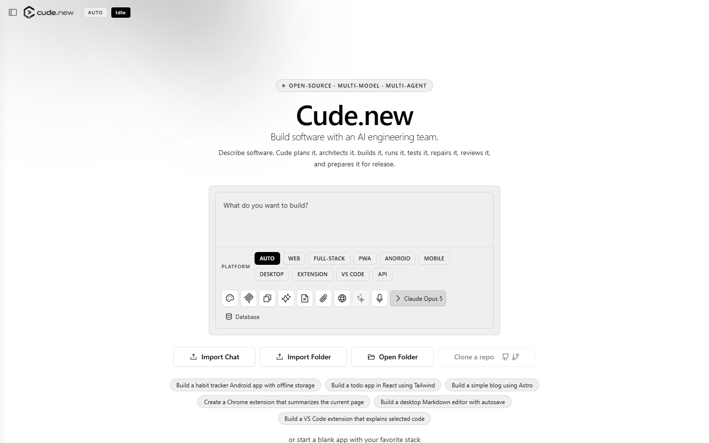
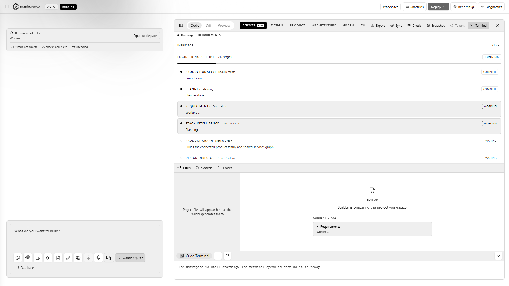
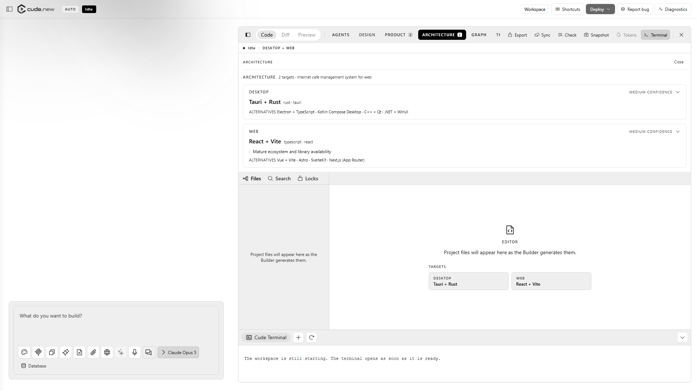
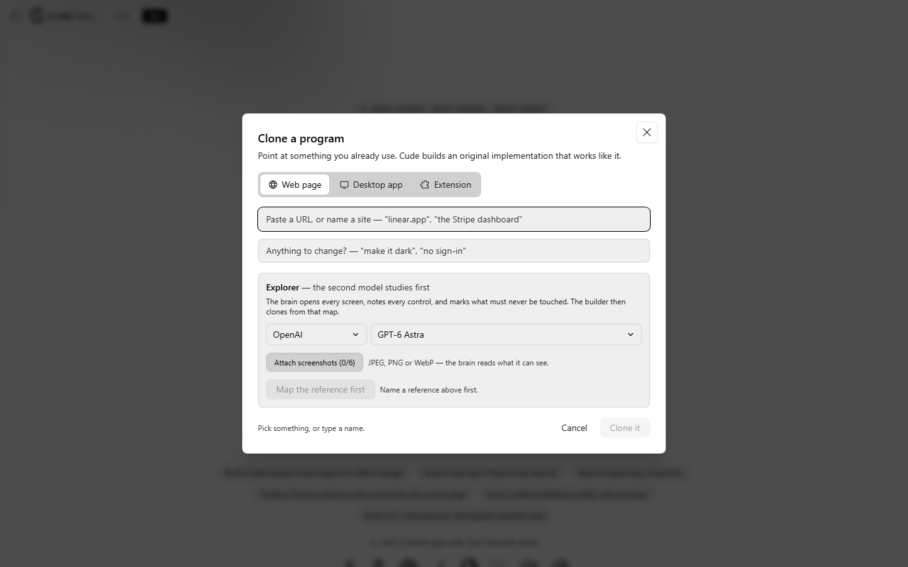
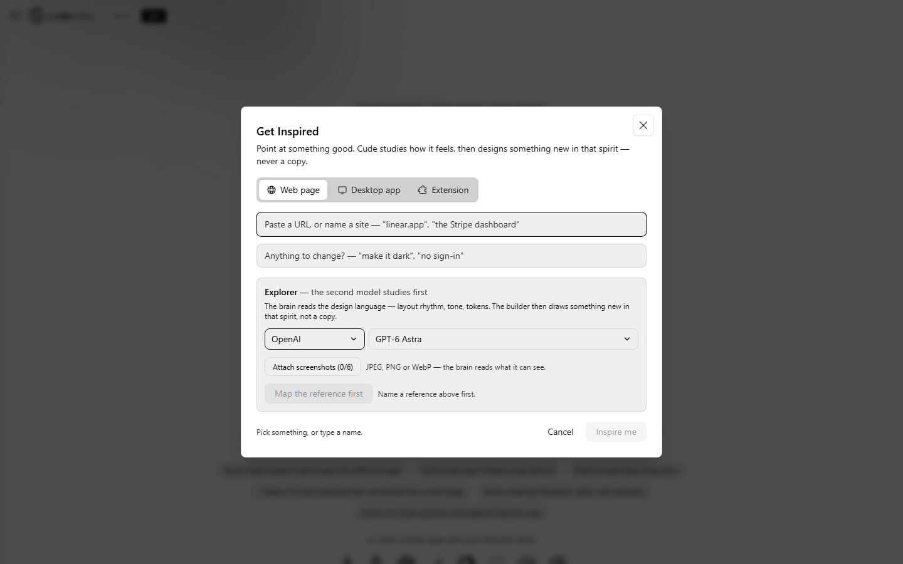
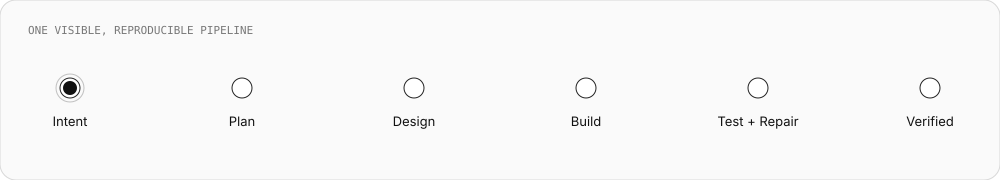

<div align="center">
  
</div>

<div align="center">
  <a href="RELEASE_NOTES_v0.1.0.md"></a>
  <a href="LICENSE"></a>
  
  
  
</div>

<p align="center">
  Turn a product brief into a planned, designed, built, tested, and reviewable project.<br />
  Run it in the browser or as a desktop application. Bring your own model.
</p>

<div align="center">
  
</div>

<details>
<summary><strong>Open the portrait launch artwork</strong></summary>
<br />
<div align="center">
  
</div>
</details>

---

## One workspace, the whole engineering run

Cude.new keeps the conversation, live project, code editor, terminal, preview,
architecture decisions, design system, test state, and file activity together.
The interface shows what the AI is doing as it happens: which stage is active,
which command ran, which file changed, and whether verification passed.

<div align="center">
  
</div>

<br />

## Product tour

Every product image below was captured from the v0.1.0 release candidate.

| Start with the right target and model | Watch the engineering pipeline run |
| --- | --- |
|  |  |
| **Inspect architecture decisions** | **Map a reference safely with Explorer** |
|  |  |

<details>
<summary><strong>See Get Inspired</strong></summary>
<br />

</details>

<br />

<div align="center">
  
</div>

## What ships in v0.1

| Capability | What it does |
| --- | --- |
| **Visible engineering pipeline** | Runs requirements, planning, architecture, design, build, test, repair, review, and security stages with real status. |
| **Live activity in chat** | Shows file writes and commands beside the conversation, then groups every changed file into a reviewable result. |
| **Architecture intelligence** | Extracts hard constraints, scores stacks per target, explains tradeoffs, and keeps the decision inspectable. |
| **Design intelligence** | Creates reusable tokens and primitives, remembers the visual system, detects drift, and repairs shared foundations. |
| **Explorer + Get Inspired** | Maps a reference with a second model before building; forbidden actions remain outside the exploration path. |
| **Multi-target products** | Coordinates web, PWA, desktop, mobile, browser extension, VS Code extension, backend, and API targets. |
| **Existing project continuation** | Opens a local folder, skips heavyweight metadata, restores the workspace, and continues from the current code. |
| **Snapshots and preflight** | Restores project state and checks files, encoding, preview readiness, and target requirements before release. |
| **Model freedom** | Registers 38 hosted and local providers, including OpenRouter and OpenAI-compatible endpoints. |

### Reference exploration without risky actions

Explorer maps structure, navigation, visual language, and interaction patterns.
Its policy marks sign-out, deletion, payment, submission, permission grants, and
other state-changing zones as forbidden. **Clone** follows the map; **Get
Inspired** preserves the useful principles while producing a distinct design.

### Product work that survives the session

`cude.project.json` stores the product graph, targets, design decisions, and
revisions. Provider credentials are filtered from project persistence, exports,
logs, and surfaced errors.

## Start locally

### Requirements

- Node.js 18.18 or newer
- Corepack with pnpm 9.14.4
- A Chromium browser with `SharedArrayBuffer` support (Chrome or Edge recommended)
- At least one provider key for generation; the shell starts without a key

```bash
git clone https://github.com/Emrevrg/cude.new.git
cd cude.new

corepack enable
corepack prepare pnpm@9.14.4 --activate
corepack pnpm install --frozen-lockfile
corepack pnpm dev
```

Open [http://localhost:5173](http://localhost:5173), choose a provider and model,
add the key in the provider row, and describe the product you want to build.
Keys can also be set in `.env.local` using `.env.example` as the reference.

<details>
<summary><strong>Run the release gates</strong></summary>

```bash
corepack pnpm run typecheck
corepack pnpm run lint
corepack pnpm test
corepack pnpm run build
```

The repository also includes focused verification harnesses:

```bash
node scripts/cude-verify.mjs
node scripts/cude-architecture-verify.mjs
node scripts/cude-design-verify.mjs
node scripts/test-export.mjs
node scripts/test-extension-runtime.mjs
node scripts/verify-desktop-runtime.mjs
```

</details>

<details>
<summary><strong>Build the desktop application</strong></summary>

```bash
# Development
corepack pnpm electron:dev

# Windows installer / unpacked application
corepack pnpm electron:build:win

# Current platform package
corepack pnpm electron:build:unpack
```

Platform-specific signing and notarization require the corresponding operating
system credentials.

</details>

<details>
<summary><strong>Run with Docker</strong></summary>

```bash
cp .env.example .env.local
corepack pnpm dockerbuild
docker compose --profile development up
```

</details>

## Choose the model that fits the job

Cude.new supports hosted providers, aggregators, local runtimes, and custom
OpenAI-compatible endpoints. The registry currently contains 38 providers; the
model list is discovered at runtime where the provider supports discovery.

OpenRouter users can select free models directly in the model picker. Provider
discovery keeps available model lists current at runtime. Local runtimes such as
Ollama, LM Studio, vLLM, llama.cpp, and LiteLLM keep compatible workloads on the
machine.

## Project anatomy

```text
app/
├─ components/cude/        product surfaces and workbench
├─ lib/cude/               pipeline, architecture, design, state, runtime
├─ lib/modules/llm/        provider adapters and model discovery
└─ routes/                 Remix pages and API boundaries

electron/                  desktop main and preload processes
functions/                 Cloudflare Pages adapter
scripts/                   release, runtime, export, and visual verification
verification-finance/      generated design-system verification fixture
```

The web application uses Remix 2, React 18, Vite 5, UnoCSS, WebContainers, and
Cloudflare Pages. The desktop target packages the same product surface with
Electron while keeping the server and route manifest inside the application.

## Verification status

The current Windows release audit passed TypeScript and ESLint with zero errors.
The unit and behavior suite contains **1,324 passing tests across 88 files**.
Production build, browser smoke, provider discovery, OpenRouter Explorer, and
the packaged desktop server path have also been exercised for this candidate.

Native packaging still depends on the host toolchain: iOS requires macOS/Xcode,
Android artifacts require the Android SDK, and signed desktop releases require
platform signing credentials. Cude.new reports these limits instead of inventing
an artifact.

See [v0.1 release notes](RELEASE_NOTES_v0.1.0.md) for the detailed matrix.

## Contributing

Issues and focused pull requests are welcome. Before opening a PR:

1. Create a branch from `main`.
2. Add or update tests for behavior changes.
3. Run the four release gates shown above.
4. Include screenshots for visible interface changes.

Read [CONTRIBUTING.md](CONTRIBUTING.md) and [SECURITY.md](SECURITY.md) before
submitting changes or reporting a vulnerability.

## License

Cude.new is distributed under the [MIT License](LICENSE). Required notices for
incorporated open-source work are retained in
[THIRD-PARTY-NOTICES.md](THIRD-PARTY-NOTICES.md).

<div align="center">
  <br />
  
  <br />
  <sub>Plan clearly. Build visibly. Release with evidence.</sub>
</div>
